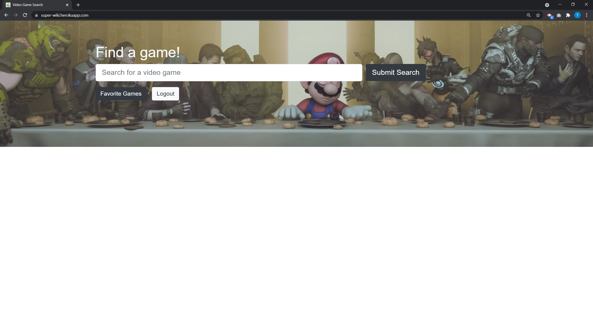
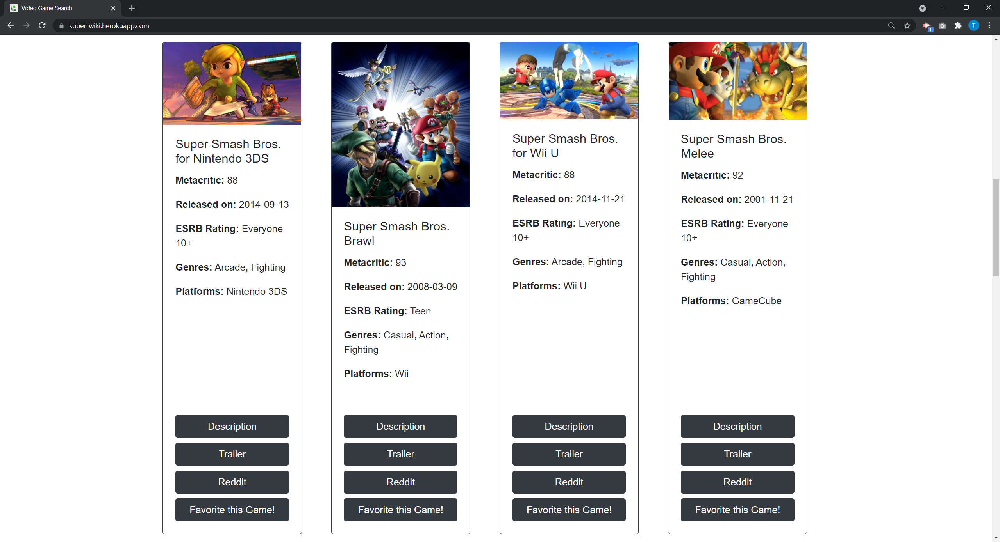
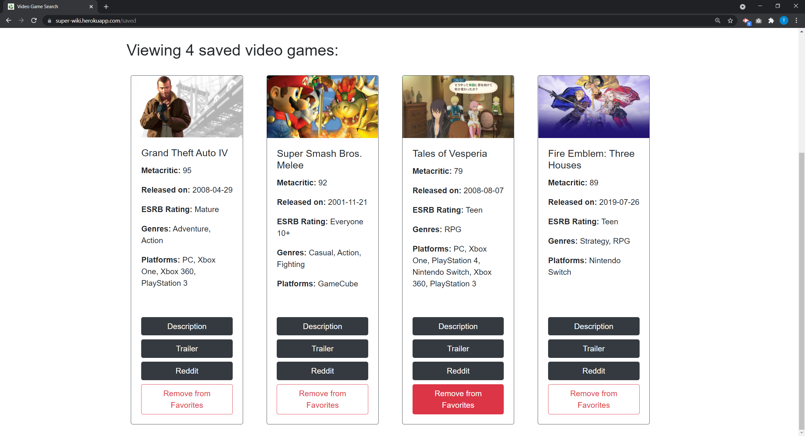

# Game House

  
  
  ## Table of Contents
  
  [Description](#description)  
  [Installation](#installation)
  [Usage](#usage)  
  [License](#license)  
  [Contributing](#contributing)    
  [Questions](#questions)
  [Screenshots](#screenshots)  
  
  ## Description
  
  AS A frequent gamer, I WANT consolidated, easy to find information about video games SO THAT I can reference it whenever I log into my account.

  ## Installation
  
  npm i
  
  ## Usage
  
  https://super-wiki.herokuapp.com/
  https://github.com/ttdunlap33/super-wiki
  
  ## License
  
  This project uses the 'The Unlicense
      ' license. 
  
  More information can be found here: https://choosealicense.com/licenses/unlicense/
  
  ## Contributing
  
  pull requests and forks.
  
  ## Questions
  
  Link to my Github: https://github.com/ttdunlap33

  Please send any questions here: ttdunlap33@gmail.com

  ## Screenshots
  

  

  
